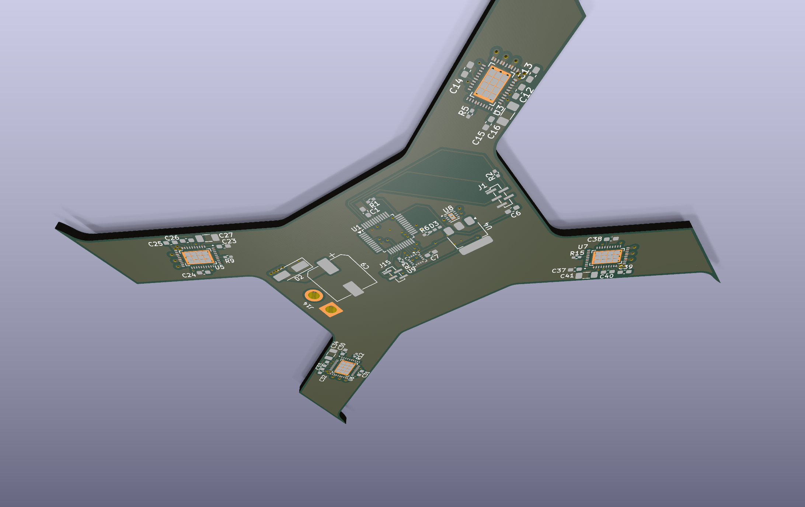
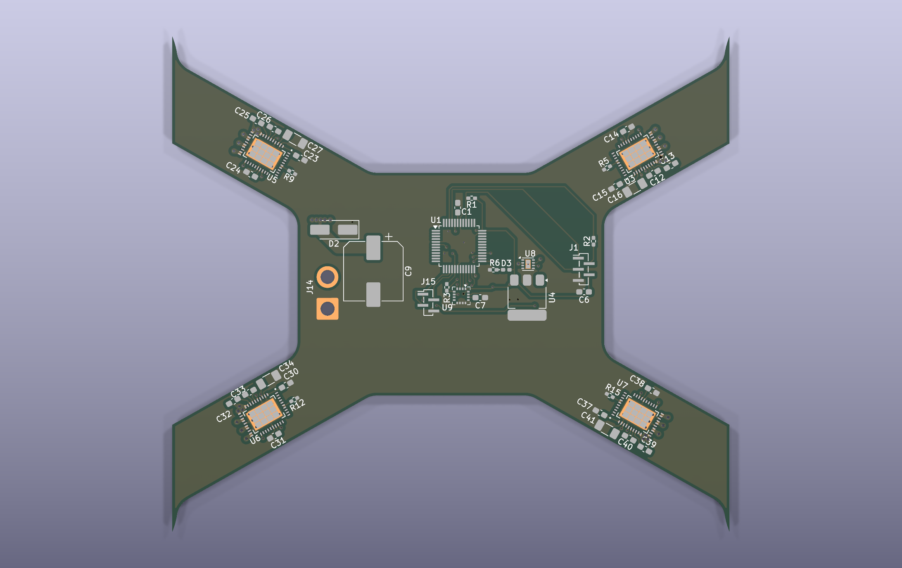
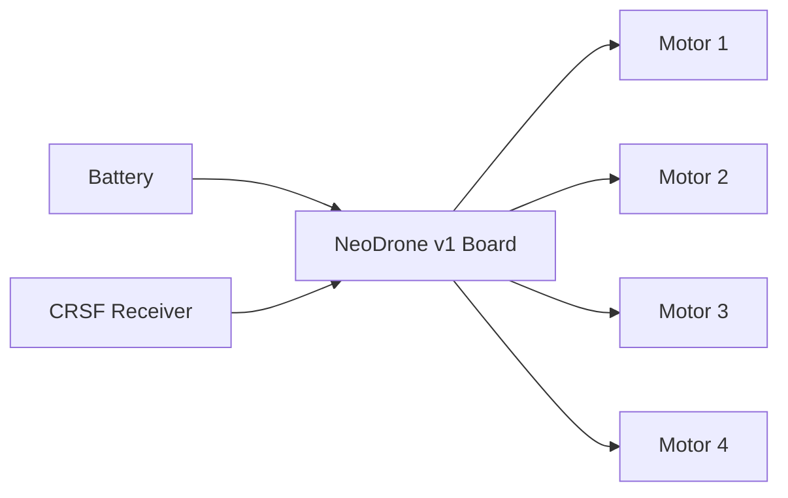

# NeoDrone v1

NeoDrone v1 is a compact all-in-one flight controller + 4-in-1 ESC board for small custom drones.

## Why I made this project

I wanted a cleaner drone stack with fewer separate boards, less wiring, and tighter integration between control and motor drive.  
This project is also a learning build to improve my PCB, embedded, and drone-systems workflow end to end.

## How to use this project

1. Clone this repository.
2. Pull firmware submodule:
   ```bash
   git submodule update --init --recursive
   ```
3. Open the hardware design in KiCad from `hardware/design/neodrone-v1.kicad_pro`.
4. Use firmware from `firmware/` (submodule) or project write-up links below.

Project links:

- [NeoDrone 3D model notes](https://dulatello08.me/blog/neodrone-3d-model/)
- [NeoDrone firmware notes](https://dulatello08.me/blog/neodrone-firmware/)
- [NeoDrone progress log #1](https://dulatello08.me/blog/neodrone-progress-1/)

### Full 3D model screenshot



### PCB screenshot



### Wiring diagram

External wiring used: 4 motors (M1-M4), battery (VBAT/GND), and CRSF receiver (UART + power).



## BOM (truncated)

Full BOM export is in `bom.csv`.  
This is a shortened reference table with links:

| Reference | Part | MPN | Qty | Link |
|---|---|---|---:|---|
| U1 | Main MCU | ATSAMD21G18A-AU | 1 | [Digi-Key](https://www.digikey.com/en/products/result?keywords=ATSAMD21G18A-AU-ND) |
| U3, U5, U6, U7 | 3-phase motor driver | MCF8316A1VRGFR | 4 | [Digi-Key](https://www.digikey.com/en/products/result?keywords=296-MCF8316A1VRGFRCT-ND) |
| U4 | 3.3V regulator | MCP1826S-3302E/DB | 1 | [Digi-Key](https://www.digikey.com/en/products/result?keywords=MCP1826S-3302E%2FDB-ND) |
| U8 | 5V buck regulator | TPS62163DSGT | 1 | [Digi-Key](https://www.digikey.com/en/products/result?keywords=296-30228-1-ND) |
| U9 | IMU | ICM-20602 | 1 | [Digi-Key](https://www.digikey.com/en/products/result?keywords=1428-1060-1-ND) |
| Q1 | P-channel MOSFET | SI7139DP-T1-GE3 | 1 | [Digi-Key](https://www.digikey.com/en/products/result?keywords=SI7139DP-T1-GE3CT-ND) |
| L1-L5 | 2.2uH inductors | SRN2510BTA-2R2M | 5 | [Digi-Key](https://www.digikey.com/en/products/result?keywords=118-SRN2510BTA-2R2MCT-ND) |
| D1 | 12V zener diode | BZT52B12 RHG | 1 | [Digi-Key](https://www.digikey.com/en/products/result?keywords=BZT52B12RHGCT-ND) |
| D2 | TVS diode | SMAJ18A-13-F | 1 | [Digi-Key](https://www.digikey.com/en/products/result?keywords=SMAJ18A-FDICT-ND) |
| C9 | Bulk electrolytic cap | EEE-FP1E331AP | 1 | [Digi-Key](https://www.digikey.com/en/products/result?keywords=PCE4439CT-ND) |
