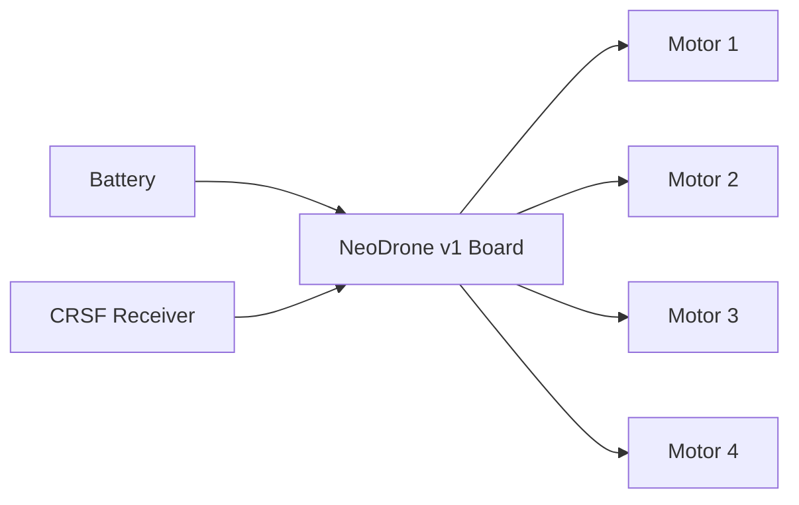

# NeoDrone v1 wiring diagram

Current planned wiring:

- 4 motors connected directly to board outputs M1-M4
- battery connected to VBAT and GND
- CRSF receiver connected to power and UART (TX/RX + GND)

